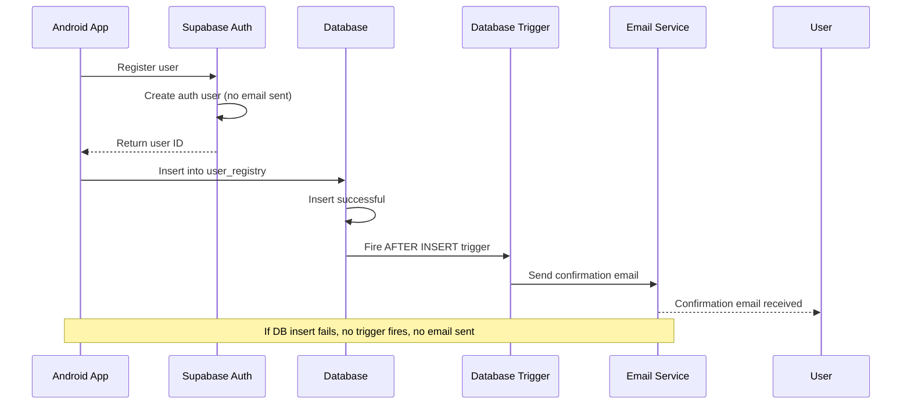

# Database Trigger Setup Guide for Email Confirmation

This guide shows how to implement Solution 3: using database triggers to send confirmation emails only after successful user_registry insertion.

## Overview

The trigger approach ensures that:
1. Auth user is created first
2. User data is inserted into user_registry table
3. **Only then** is the confirmation email sent
4. If database insertion fails, no email is sent

## Step-by-Step Setup

### 1. Update Supabase Auth Settings

1. Go to your Supabase Dashboard
2. Navigate to **Authentication** → **Settings**
3. Under **Email Confirmation**:
   - Set **Enable email confirmations** to `OFF`
   - This prevents automatic emails during auth registration

### 2. Deploy the Edge Function

1. Install Supabase CLI if you haven't already:
   ```bash
   npm install -g supabase
   ```

2. Login to Supabase:
   ```bash
   supabase login
   ```

3. Link your project:
   ```bash
   supabase link --project-ref your-project-id
   ```

4. Deploy the Edge Function:
   ```bash
   supabase functions deploy send-confirmation-email
   ```

### 3. Set Up Environment Variables

In your Supabase Dashboard → Settings → Edge Functions, add:
- `SITE_URL`: Your app's URL (e.g., `https://yourapp.com`)

### 4. Create the Database Trigger

1. Go to your Supabase Dashboard
2. Navigate to **SQL Editor**
3. Run the SQL from `database_trigger_setup.sql`
4. **Important**: Replace `your-project-id` with your actual project ID

### 5. Update Your Android Code

No changes needed to your Android code! The existing `registerUserTransactionally` method will work perfectly with this setup.

## How It Works



## Testing

### Test Successful Registration
1. Register a new user through your app
2. Check that:
   - User appears in `auth.users` table
   - User appears in `user_registry` table
   - Confirmation email is received

### Test Failed Registration
1. Temporarily break the database insert (e.g., add a constraint)
2. Register a new user
3. Check that:
   - User appears in `auth.users` table
   - User does NOT appear in `user_registry` table
   - No confirmation email is received

## Monitoring

### Check Trigger Execution
```sql
-- View recent trigger executions
SELECT * FROM pg_stat_user_functions 
WHERE funcname = 'send_user_confirmation_email_via_edge';
```

### Check Email Logs
- Go to Supabase Dashboard → Logs
- Filter by "Edge Functions" to see email sending logs

### Check Database Logs
```sql
-- View recent database logs
SELECT * FROM pg_stat_statements 
WHERE query LIKE '%user_registry%';
```

## Troubleshooting

### Common Issues

1. **Trigger not firing**
   - Check if the trigger exists: `\d+ user_registry`
   - Verify the function exists: `\df send_user_confirmation_email_via_edge`

2. **Edge Function not called**
   - Check Edge Function logs in Supabase Dashboard
   - Verify the project URL in the trigger function

3. **Emails not sending**
   - Check email service configuration
   - Verify SMTP settings in Supabase Dashboard

### Debug Commands

```sql
-- Test the trigger function directly
SELECT send_user_confirmation_email_via_edge();

-- Check trigger status
SELECT 
    trigger_name, 
    event_manipulation, 
    action_timing, 
    action_statement 
FROM information_schema.triggers 
WHERE event_object_table = 'user_registry';
```

## Security Considerations

1. **Service Role Key**: The trigger uses the service role key to call the Edge Function
2. **Permissions**: Ensure proper RLS policies are in place
3. **Rate Limiting**: Consider implementing rate limiting for email sending

## Benefits of This Approach

✅ **Atomic**: Email only sent after successful database insert
✅ **Reliable**: No orphaned auth users with emails
✅ **Flexible**: Easy to customize email content
✅ **Auditable**: Full logging of email sending
✅ **Scalable**: Works with high-volume registrations

## Alternative: Simpler Approach

If the Edge Function approach seems complex, you can use the simpler built-in approach:

```sql
-- Simple trigger using Supabase's built-in email function
CREATE OR REPLACE FUNCTION send_confirmation_email_simple()
RETURNS TRIGGER AS $$
BEGIN
    -- This uses Supabase's built-in email confirmation
    PERFORM auth.send_confirmation_email(NEW.email);
    RETURN NEW;
END;
$$ LANGUAGE plpgsql SECURITY DEFINER;

CREATE TRIGGER trigger_send_confirmation_simple
    AFTER INSERT ON user_registry
    FOR EACH ROW
    EXECUTE FUNCTION send_confirmation_email_simple();
```

This simpler approach may not work in all Supabase configurations, so the Edge Function approach is recommended.

